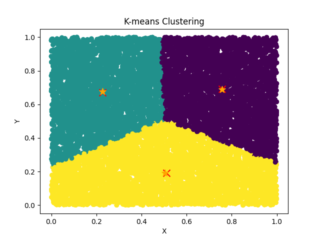

# HPC with Machine Learning

We will be learning about a few machine learning algorithms in this section. 
Then we will study how to parallelize this workload.

## Pre-requisites

```bash
pip install pandas matplotlib scikit-learn imageio
```


## KMeans Clustering

### Sequential Algorithm

K-means clustering is a popular unsupervised machine learning algorithm used for clustering analysis. It aims to partition a given dataset into k clusters, where each data point belongs to the cluster with the nearest mean (centroid). The number of clusters, k, is specified by the user.

The algorithm works as follows:

1. Initialization: Randomly select k data points as the initial centroids.

2. Assignment: Assign each data point to the nearest centroid based on a distance metric (usually Euclidean distance).

3. Update: Recalculate the centroids by taking the mean of all data points assigned to each centroid.

4. Repeat steps 2 and 3 until convergence (either a maximum number of iterations is reached or the centroids do not change significantly between iterations).

The goal of K-means clustering is to minimize the sum of squared distances between each data point and its assigned centroid. This objective function is often referred to as within-cluster variance or inertia.

K-means clustering has several applications, including customer segmentation, image compression, anomaly detection, and document clustering. However, it is important to note that K-means is sensitive to the initial centroid positions and can converge to suboptimal solutions. Therefore, it is common to run the algorithm multiple times with different initializations and select the solution with the lowest inertia.

[Source Code](kmeans.py)

```bash
import numpy as np
np.random.seed(123)

K = 3
N = 10000
M = 2

X = np.random.rand(N, M)
max_iter = 300


kmeans = KMeans(n_clusters=K, max_iter=max_iter)
kmeans.fit(X)

print(kmeans.centroids)
print(kmeans.labels)

```

### Visualizing Training


### Visualizing Final Output comparison

Here we are comparing the output from our code and Scikit-Learn.
Note `X` and `*` are the symbols used for plotting the centroids.




### Distributed Algorithm


### Running KMeans

Make sure your current folder is `machine_learning`

Run the sequential version of the algorithm

```bash
python kmeans.py
```

Run the distributed version of the algorithm

```bash
mpirun -n 4 python3 distributed_kmeans.py
```